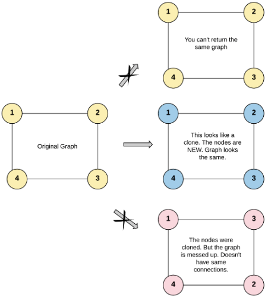
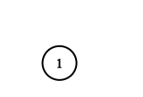

# 133. Clonar Grafo - Médio 2

## Problema:
> Dada uma **referência** de um **nó** em um grafo não direcionado e conectado.

> Retorne uma cópia profunda (clone) do grafo.

> Cada nó no grafo contém um valor (int) e uma lista (List[Node]) de seus vizinhos.
```
class Node {
    public int val;
    public List<Node> neighbors;
}

```
> Para simplificar, o valor de cada nó é o mesmo que o índice do nó (indexado a partir de 1). Por exemplo, o primeiro nó tem **val == 1**, o segundo nó tem **val == 2** e assim por diante. O grafo é representado no caso de teste usando uma **lista de adjacência**.

> Uma lista de adjacência é uma coleção de listas não ordenadas usada para representar um grafo finito. Cada lista descreve o conjunto de vizinhos de um nó no grafo.

> O nó fornecido será sempre o primeiro nó com **val = 1**. Você deve retornar a cópia do nó fornecido como uma referência para o grafo clonado.

## Restrições:
- O número de nós no grafo está contido no intervalo [0, 100]
- O valor de um nó varia entre 1 e 100
- O valor de um nó é único
- Não existem arestas repetidas nem arestas de um vértice para si mesmo (self-loops)
- O grafo é conectado e todos os nós pode ser visitados a partir de qualquer nó

## Exemplos:

### Exemplo 1:

<div style="text-align: center;">
    
</div>
</br>

Entrada: 

**adjList = [[2,4],[1,3],[2,4],[1,3]]**

Saída:

**[[2,4],[1,3],[2,4],[1,3]]**

Explicação:
> - Existem 4 nós no grafo.
> - Os vizinhos do 1º nó (val = 1) são o 2º nó (val = 2) e o 4º nó (val = 4).
> - Os vizinhos do 2º nó (val = 2) são o 1º nó (val = 1) e o 3º nó (val = 3).
> - Os vizinhos do 3º nó (val = 3) são o 2º nó (val = 2) e o 4º nó (val = 4).
> - Os vizinhos do 4º nó (val = 4) são o 1º nó (val = 1) e o 3º nó (val = 3). 

</br>

### Exemplo 2:

<div style="text-align: center;">
    
</div>
</br>

Entrada: 

**adjList = [[]]**

Saída:

**[[]]**

Explicação:
> - O grafo só possui um nó, logo não possui arestas.

### Exemplo 3:

Entrada: 

**adjList = []**

Saída:

**[]**

Explicação:
> - O grafo não contém nós.

## Solução proposta: