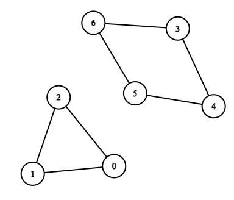
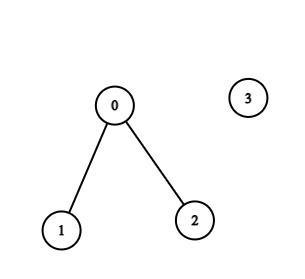

# 2608. Menor Ciclo em um Grafo - Difícil 1

## Problema:
> Existe um grafo bidirecional com **n** vértices, onde cada vértice é rotulado de 0 a n - 1. As arestas no grafo são representadas por uma **matriz 2D** de inteiros chamada **edges**, onde edges[i] = [ui, vi] denota uma aresta entre o vértice ui e o vértice vi. Cada par de vértices é conectado por no máximo uma aresta, e nenhum vértice possui uma aresta que se conecta a ele mesmo.

> Retorne o comprimento do menor ciclo no grafo. Se nenhum ciclo existir, retorne -1.

> Um ciclo é um caminho que começa e termina no mesmo nó, e cada aresta no caminho é usada apenas uma vez.

## Restrições:
- 2 <= n <= 1000
- 1 <= edges.length <= 1000
- edges[i].length == 2
- 0 <= ui, vi < n
- ui != vi

## Exemplos:

### Exemplo 1:

<div style="text-align: center;">
    
</div>
</br>

Entrada: 

**n = 7, edges = [[0,1],[1,2],[2,0],[3,4],[4,5],[5,6],[6,3]]**

Saída:

**3**

Explicação:
> - O ciclo de menor comprimento, isto é: **0 -> 1 -> 2 -> 0** inclui 3 vértices (ou nós). 

</br>

### Exemplo 2:

<div style="text-align: center;">
    
</div>
</br>

Entrada: 

**n = 4, edges = [[0,1],[0,2]]**

Saída:

**-1**

Explicação:
> - O grafo não contém ciclos.

## Solução proposta:

Para soluções em C++, o LeetCode oferece o seguinte ponto de partida:

```
class Solution {
public:
    int findShortestCycle(int n, vector<vector<int>>& edges) {
        
    }
};
```

Ou seja, ele requer uma classe "solução", a qual contenha uma função pública **int findShortestCycle(int n, vector<vector<int>>& edges)** a qual, recebendo um número de vértices **n** e uma matriz de adjacência **edges**, retorne o tamanho do menor ciclo no grafo, ou -1, caso este seja acíclico.

A primeira coisa a fazer é montar um grafo a partir da matriz de adjacências recebida, fazer isso é conveniente para não impactar em nada a matriz original. Para isso foi utilizada a função **vector<vector<int>> copiaGrafo(int nVertices, const vector<vector<int>>& matrizAdj)**:

</br></br></br></br></br></br>

```    
vector<vector<int>> copiaGrafo(int nVertices, const vector<vector<int>>& matrizAdj){
        vector<vector<int>> novoGrafo(nVertices);
        for(const auto& aresta : matrizAdj){
            int u = aresta[0], v = aresta[1];
            novoGrafo[u].push_back(v);
            novoGrafo[v].push_back(u);
        }
        return novoGrafo;
    }
```

Feita a cópia do grafo original, definiu-se um inteiro para armazenar o menor ciclo encontrado (tamanhoMenorCiclo). Inicialmente, essa variável era iniciada com valor -1, uma vez que ele representa um grafo sem ciclos. No entanto, tal valor dificultava a comparação com ciclos encontrados, visto que nenhum seria menor que 1. Devido a isso, a variável foi iniciada com o maior valor inválido possivel INT_MAX, constante da biblioteca "climits" para o maior inteiro possível para que qualquer ciclo detectado seja menor que esse valor inicial (nenhum grafo tem mais de 1000 nós).

```
int tamanhoMenorCiclo = INT_MAX;
```

Em seguida, é feita uma busca em largura adaptada que retorna o tamanho do menor ciclo do qual um vértice faz parte. Como essa busca é feita para cada nó, garante-se que a busca vai encontrar pelo menos o menor ciclo do qual cada nó é integrante. A busca em largura (BFS) foi escolhida pois, como ela percorre o grafo em camadas, fica mais fácil encontrar mais rápido o menor ciclo que um vértice faz parte. Realizada a busca, é feita a verificação se o menor ciclo do qual um nó faz parte é menor que o menor ciclo encontrado até então.

```
for(int v = 0; v < n; v++){
    int tamanhoCiclo = BFS(n, v, grafo);
    if(tamanhoCiclo != INT_MAX) 
        tamanhoMenorCiclo = min(tamanhoMenorCiclo, tamanhoCiclo);
}
```

Por fim, faz-se a comparação entre o melhor ciclo encontrado na busca (tamanhoCiclo) e o tamanhoMenorCiclo, selecionando o menor deles. Caso o tamanhoMenorCiclo seja igual a INT_MAX, significa que a busca não encontrou ciclos através de nenhum vértice, ou seja, o grafo é acíclico, logo, a função retorna -1, caso contrário, retorna o tamanho do maior ciclo.

```
return tamanhoMenorCiclo == INT_MAX ? -1 : tamanhoMenorCiclo;
```