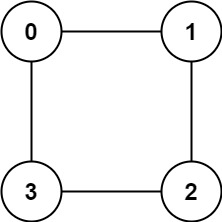

# 785. O grafo é Bipartido? - Médio 1

## Descrição do Problema

Há um grafo não direcionado com `n` nós, onde cada nó é numerado entre `0` e `n - 1`. Você recebe um array 2D `graph`, onde `graph[u]` é um array de nós aos quais o nó `u` é adjacente. Mais formalmente, para cada `v` em `graph[u]`, existe uma aresta não direcionada entre o nó `u` e o nó `v`. O grafo possui as seguintes propriedades:

- Não existem laços (ou seja, `graph[u]` não contém o próprio `u`).
- Não existem arestas paralelas (ou seja, `graph[u]` não contém valores duplicados).
- Se `v` está em `graph[u]`, então `u` está em `graph[v]` (o grafo é não direcionado).
- O grafo pode não ser conexo, o que significa que pode haver dois nós `u` e `v` tal que não existe um caminho entre eles.

### Grafo Bipartido

Um grafo é **bipartido** se os nós podem ser particionados em dois conjuntos independentes A e B, de tal forma que cada aresta no grafo conecte um nó no conjunto A a um nó no conjunto B.

### Objetivo

Retorne `true` se e somente se o grafo for bipartido.

## Restrições

- `graph.length == n`
- `1 <= n <= 100`
- `0 <= graph[u].length < n`
- `0 <= graph[u][i] <= n - 1`
- `graph[u]` não contém `u`.
- Todos os valores de `graph[u]` são únicos.
- Se `graph[u]` contém `v`, então `graph[v]` contém `u`.

## Exemplos:

### Exemplo 1:

<div style="text-align: center;">
    
</div>
</br>

Entrada:

**graph = [[1,2,3],[0,2],[0,1,3],[0,2]]**

Saída:

**false**

Explicação:

> - Não há maneira de particionar os nós em dois conjuntos independentes de tal forma que toda aresta conecte um nó de um conjunto a um nó do outro.

### Exemplo 2:

<div style="text-align: center;">
    
</div>
</br>

Entrada

**graph = [[1,3],[0,2],[1,3],[0,2]]**

Saída

**false**

Explicação:

> - Podemos particionar os nós em dois conjuntos: {0, 2} e {1, 3}.

## Solução proposta:

Para este exercício, a dupla decidiu usar a linguagem C++

Para soluções em C++, o LeetCode oferece o seguinte ponto de partida:

</br></br></br></br></br></br>

```
class Solution {
public:
    bool isBipartite(vector<vector<int>>& graph) {

    }
};
```

Ou seja, ele requer uma classe "solução", a qual contenha uma função pública que, recebendo uma matriz de adjacências, retorna se o grafo é bipartido ou não.

O primeiro passo a ser feito para chegar na solução do problema é identificar o tamanho do grafo. Isso pode ser realizado em **C++** através do método `size()`

O segundo passo a ser feito é definir um vetor para "colorir" os nós do grafo, a fim de saber se é bipartido ou não.

> RELEMBRANDO!
>
> - Nas aulas com o professor Maurício Serrano, entendemos que, para que um grafo seja bipartido, seus "vizinhos" não podem ter a mesma cor, definidos de forma sistemática como azul e vermelho.
> - DICA 1: Se um nó possui vizinho(s) de cores diferentes, torna-se necessário verificar os vizinhos dos vizinhos, a fim de saber se o grafo satisfaz a condição de ser bipartido
> - Dessa forma, a dupla entendeu que usando um tipo de busca em grafos (seja DFS ou BFS) o problema poderia ser resolvido de forma simples e eficaz!

No terceiro passo, por fim, iteramos sobre cada nó do grafo. Se o nó não foi colorido, isto é, `coloracao[i]==0`, a função de busca em largura é invocada para realizar a rotina de colorir o nó.

> Investigando a função de Busca em Largura!

```
bool bfs(vector<vector<int>>& graph, vector<int>& coloracao, int s)
```

Começamos definindo a função de busca em largura, que recebe a matriz de adjacências representando o grafo alvo, o vetor `coloracao` e o índice de partida `s`.

A primeira coisa a se fazer é colorir o nó de partida `s` com o número `-1`. O objetivo é inicialmente começar a busca com o nó possuindo uma cor arbitrária, e alterar as cores conforme os vizinhos sejam visitados.

A segunda coisa é possuir uma fila, que em **C++** pode ser utilizada por meio da classe `queue`, e inserir o nó `s` para começar o processamento.

A terceira coisa é iniciar a rotina da BFS. Enquanto a fila não estiver vazia, o algoritmo pega o nó atual da fila e percorre todos os vizinhos desse nó. Se algum vizinho já foi colorido com a mesma cor que o nó atual, isso significa que o grafo **NÃO É** bipartido, e a função retorna **false**. Caso contrário, se o vizinho ainda não tem cor, o algoritmo vai atribuir ao vizinho a cor **OPOSTA** à do nó atual.

A quarta coisa, por fim, é incluir o vizinho à fila para continuar o processamento.